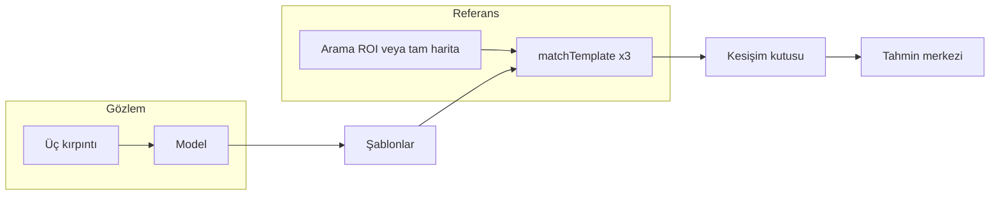

# GPS’siz yerelleştirme simülasyonu

Bu depo, İHA’nın **gözlem haritasından** üç komşu bölgeden alınan görüntüleri (üçlü şablon) bir **derin öğrenme modelinden** geçirip, çıktıları **referans haritada** OpenCV şablon eşleştirmesi ile arayarak konum tahmini sürecini simüle eder. Tahmin, üç eşleşme kutusunun kesişiminden veya geometrik tutarlılık modlarından türetilir; arama bölgesi (ROI) önceki tahmine göre uyarlanır veya tüm haritaya genişler.

Ana uygulama `simulasyon_yonlendirme_uclu_dashboard.py` artık **GPS-Denied Mission Control** arayüzünü açar. PySide6 tabanlı pencere; gerçek Qt kontrolleri, erişilebilir telemetri kartları, görsel kanıt sekmeleri, yükleme durumu ve merkezi operasyon haritası sunar. PySide6 bulunamazsa PyQt5 uyumluluk katmanı, iki Qt bağlayıcısı da bulunamazsa OpenCV arayüzü kullanılır.

2026 yenilemesinin öne çıkanları:

- GeoTIFF dosyaları varsayılan olarak Rasterio pencere erişimi ve `WarpedVRT` ile kullanılır; çok GB boyutlu rasterler başlangıçta tamamen RAM'e alınmaz.
- TensorFlow yalnızca model gerçekten yükleneceğinde import edilir; komut satırı ve pencere hızlı açılır.
- Kalman filtresi gerçek dört durumlu `x, y, vx, vy` sabit-hız modelidir.
- Normalize korelasyon skoru artık sıfırı `%50 güven` olarak yorumlamaz; negatif korelasyon sıfır kanıt kabul edilir.
- Her adımın çekirdek işlem süresi CSV'deki `islem_ms` alanına ve Mission Control alt durum çubuğuna yazılır.

---

## Depo yapısı

| Dosya | Rol |
|--------|-----|
| `simulasyon_yonlendirme_uclu_dashboard.py` | Simülasyon motoru, şablon eşleştirme ve isteğe bağlı OpenCV çizim katmanı |
| `mission_control_ui.py` | Semantik PySide6/PyQt5 Mission Control arayüzü |
| `simulation_core/filters.py` | Dört durumlu sabit-hız Kalman filtresi |
| `simulation_core/raster_source.py` | Düşük bellekli, pencere tabanlı GeoTIFF erişimi ve grid hizalama |
| `tests/` | Kalite, filtre, raster ve hızlı CLI regresyon testleri |
| `gps_denied_autonomy.py` | Lokalizasyon kalitesi, sensör füzyonu, waypoint ilerlemesi ve otonom hareket seçimi için yardımcı modül (dashboard tarafından **import edilir** ve aktif kullanılır) |
| `simulasyon_yonlendirme_model_okuma.py` | Model okuma / ilgili deney akışı |
| `simulasyon_yonlendirme.py`, `simulasyon_yonlendirme_uclu.py` | Daha eski veya sadeleştirilmiş yönlendirme denemeleri |
| `simulasyon_otonom.py`, `simulasyon_konuma_otonom_gitme*.py`, `simulasyon_hizli.py` | Otonom veya hızlı varyant denemeleri |
| `template_matching_dongu.py`, `image_rotate.py`, `image_rotate_funcs.py` | Şablon eşleştirme ve görüntü dönüş yardımcıları |
| `GPS_DENIED_REVIEW.md` | GPS’siz otonomi ve kalite mantığına dair notlar |

---

## Gereksinimler

- **Python** 3.8+ (3.x; TensorFlow sürümünüze uygun bir Python seçin)
- **OpenCV** (`cv2`) — görüntü I/O, `matchTemplate`, arayüz
- **NumPy**
- **Rasterio** — `.tif` / GeoTIFF okuma; gözlemi referans ızgarasına hizalama
- **pyproj** — koordinat dönüşümleri (irtifa / DEM ile arazi örneklemesi)
- **TensorFlow 2 + Keras** — `.h5` model yükleme; eski modeller için `Conv2DTranspose` uyumluluk sınıfı kullanılır
- **PySide6** — Önerilen ve varsayılan Mission Control arayüzü
- **PyQt5** *(isteğe bağlı uyumluluk)* — PySide6 yoksa kullanılabilir
- **Pillow** *(isteğe bağlı)* — HUD’da Türkçe karakterlerin doğru render edilmesi için; yoksa ASCII’ye sadeleştirilir

Örnek kurulum:

```bash
pip install -e ".[dev]"
```

GPU isteğe bağlıdır; CPU ile de çalışır, model çıkarımı daha yavaş olur. Çok büyük rasterler için `OPENCV_IO_MAX_IMAGE_PIXELS` betik içinde yükseltilmiştir.

---

## Veri dosyaları ve yollar

Tüm yollar `SimulationConfig` içinde `pathlib.Path` olarak tanımlıdır; kendi harita ve model dosyalarınıza göre düzenlemeniz gerekir.

| Alan | Açıklama |
|------|----------|
| `reference_map_path` | Referans harita: GeoTIFF (`.tif`) veya düz gri görüntü |
| `observation_map_path` | Gözlem kaynağı (genelde uydudan / ortofoto raster) |
| `observation_georef_path` | Gözlemin jeodezik referansı (çoğu kurulumda gözlem haritası ile aynı dosya) |
| `observation_grid_georef_path` | İsteğe bağlı; `align_observation_to_reference_grid=True` iken hizalama için kullanılır |
| `dem_path` | **Yalnızca `scenario_mode` irtifa senaryosunda** zemin yüksekliği ve AGL hesabı |
| `model_path` | Keras `.h5` modeli (giriş boyutu `model_input_size` ile uyumlu olmalı) |

**Senaryo modu** (`scenario_mode`):

- `"normal"` veya `"standart"` — Sabit ölçek / irtifa varsayımı; DEM yüklenmez.
- `"irtifa"` / `"altitude"` / `"elevation"` — Sanal kamera GSD’si, yama ölçekleri ve zemin kotu için DEM + gözlem rasteri kullanılır.

`stream_rasters=True` iken referans ve gözlem dosyaları pencere bazlı okunur. Gözlem grid'i farklıysa `WarpedVRT`, yalnızca istenen pencereyi referans grid'ine yeniden örnekler. Eski tam-bellek davranışı karşılaştırma amacıyla `--raster-bellek` ile seçilebilir.

---

## Çalıştırma

Proje kökünden (veya veri dosyalarının göreli yolların doğru çözüldüğü dizinden):

```bash
python simulasyon_yonlendirme_uclu_dashboard.py
```

Windows'ta çift tıklanabilir başlatıcı:

```text
run_mission_control.cmd
```

Tüm varsayılanlar `SimulationConfig` dataclass içindedir; ayrıca sık değişen birkaç parametre **komut satırı argümanıyla** geçersiz kılınabilir:

| Argüman | Karşılık |
|---------|----------|
| `--senaryo {normal,irtifa}` | `scenario_mode` |
| `--referans YOL` | `reference_map_path` (dosya veya klasör) |
| `--gozlem YOL` | `observation_map_path` |
| `--model YOL` | `model_path` (dosya veya klasör) |
| `--adim-px N` | `step_size` |
| `--arama-penceresi N` | `base_search_window_size` |
| `--raster-stream` / `--raster-bellek` | Pencere bazlı veya tam-bellek raster erişimi |
| `--kalman` / `--kalman-yok` | `kalman_enabled` |
| `--csv-yok` | `log_csv_enabled=False` |
| `--csv-dosya YOL` | `log_csv_path` |
| `--otonom-aralik-ms MS` | `autonomous_step_interval_ms` |
| `--rastgele-baslangic` / `--sabit-baslangic` | `random_start` |

Verilmeyen argümanlar `SimulationConfig` varsayılanını korur. Daha geniş davranış değişikliği için sınıfı düzenleyin veya `SimulationConfig(...)` örneğini `main()` / `main_qt()` içine bağlayın.

---

## İşleyiş özeti (pipeline)

1. **Varlık yükleme** — Referans ve gözlem haritaları gri ton matrisi olarak; model `load_model_compat` ile.
2. **Üçlü çıkarım** — Gözlem üzerinde başlığa göre döndürülmüş büyük bir yakalama alanından üç komşu pencere; her biri modele girer, çıkan şablonlar referansta aranır.
3. **Eşleştirme** — `cv2.matchTemplate` (varsayılan `TM_CCOEFF_NORMED`); isteğe bağlı **piramit** (`coarse_scale` + dar ROI) ve **3 iş parçacığı** ile üç şablon paralel.
4. **Kesişim** — Üç eşleşme kutusunun kesişimi veya çiftler üzerinden `intersection_mode` (ör. `abc`, `ab`, …).
5. **Güven kapısı** — Düşük varyanslı şablon, zayıf skor, geometrik üçlü uyumsuzluğu ve belirsiz tepe marjı ölçümü reddedilir; yalnız güvenilir sonuç Kalman ve takip merkezini günceller.
6. **Arama penceresi** — Güvenilir ve katı üçlü hizalamalı sonuçta taban pencereye dönülür; düşük güvende `search_window_failure_growth` ile büyür (üst sınır `max_search_window_size`).
7. **Bilinen başlangıç / kademeli yeniden kazanım** — `initial_position_known=True` iken yalnız ilk başlangıç konumu bilinen sabit kabul edilir ve ilk eşleme doğrudan turuncu ROI içinde yapılır. Sonraki gerçek konumlar algoritmaya verilmez. Güven kaybedilirse turuncu ROI her adımda kademeli büyür; `progressive_global_recovery=True` iken tam-harita moduna ancak ROI zaten haritanın uzun kenarını kaplayacak boyuta ulaştığında geçilir.



---

## `SimulationConfig` — seçilmiş alanlar

Aşağıdaki gruplar, sık değişen veya anlamı net olmayan alanları listeler; tam liste için kaynak dosyasına bakın.

### Gözlem ve model boyutları

- `sample_window_size`, `model_input_size`, `crop_margin`, `template_size` — Birbirleriyle tutarlı olmalı; `validate_config` model çıktı boyutunun `template_size` ile eşleşmesini kontrol eder.
- `template_offset` — Üç şablonun beklenen göreli aralığı (piksel); katı hizalama testinde kullanılır.

### Hareket ve başlangıç

- `initial_row` / `initial_col`, `random_start`, `random_start_middle_band_ratio` — Başlangıç gözlem imleci; rastgele modda merkeze bias’lı örnekleme.
- `initial_position_known` — `True` iken yalnız ilk başlangıç konumunu referans haritada bilinen öncül olarak kullanır; başlangıçta tam-harita taramasını önler.
- `step_size`, `initial_heading_degrees`, `rotation_step_degrees`
- `initial_altitude_agl_m`, `altitude_step_m`, `min_altitude_agl_m`, `max_altitude_agl_m`, `minimum_patch_agl_m`

### Kamera ve ölçek (irtifa senaryosu)

- `reference_map_gsd_cm_per_px`, `camera_sensor_width_mm`, `camera_focal_length_mm`, `virtual_camera_width_px`
- DEM'den hesaplanan her yama ölçeği hem gerçek kutu boyutuna hem referansta aranan şablon boyutuna uygulanır. `observation_grid_georef_path=None` varsayılanı gözlem GeoTIFF'inin kendi CRS/transform bilgisini kullanır.
- Ölçek düzeltmesi geometrik olarak çalışsa da modelin eğitim ölçeğinden çok uzak, çok düşük irtifa örnekleri güvenilir olmayabilir; bu durum geometri/benzersizlik kapısında reddedilir ve yeniden kazanım tetikler.

### Eşleştirme ve arama

- `match_method` — Örn. `cv2.TM_CCOEFF_NORMED`; SQDIFF ailesi için min/max seçimi kodda ayrı işlenir.
- `use_parallel_matching`, `use_pyramid_matching`, `coarse_scale`, `roi_pad_factor`
- `base_search_window_size`, `max_search_window_size`, `search_window_growth_step`, `search_window_failure_growth`
- `triplet_alignment_tolerance_px` — Üç kutunun “kilit” sayılması için geometrik tolerans
- `global_refresh_interval` — `0` dışında ise belirli adımlarda tam harita araması
- `localization_template_std_threshold` — Boş/düşük varyanslı model çıktısını reddeder
- `localization_peak_margin_threshold` — En iyi ve ikinci bağımsız eşleşme tepesi arasındaki asgari fark
- `localization_score_threshold`, `localization_confidence_threshold` — Gerçek veriyle kalibre edilen skor ve birleşik güven tabanları; benzersizlik ve üçlü geometri kontrolleri ayrıca zorunludur
- `localization_require_strict_triplet` — Güvenilir ölçüm için beklenen üçlü geometrisini zorunlu kılar
- `global_recovery_after_low_confidence_steps` — Ardışık düşük güven sonrası global yeniden kazanım eşiği
- `global_recovery_min_window_size` — Global yeniden aramadan önce turuncu ROI'nin ulaşması gereken asgari genişlik
- `progressive_global_recovery` — Tam taramaya ani sıçramayı önler; ROI sınırını gerektiğinde harita boyutuna kadar kademeli büyütür

### Arayüz

- Mission Control pencere düzeni ekran DPI'ına göre Qt tarafından ölçeklenir.
- Arayüz, gündüz kullanımına uygun Ground Control Station paleti kullanır: soğuk mavi-gri yüzeyler, havacılık mavisi yöntem vurguları ve durumlara ayrılmış yeşil/amber/kırmızı renkler.
- Üst komut alanı davranışı değiştiren **İşlem / Yöntem** kontrollerini (Otonom, Kalman, 544/272 girdi, HAM/CLAHE/HISTEQ/EDGE normalizasyonu) yalnızca çizimi değiştiren **Görünüm** kontrollerinden (Rota, Arama Alanı) ayırır.
- Sol panelde gözlem, model ve eşleşme aynı anda alt alta görünür; aralarındaki yatay ayırıcılarla yükseklikleri değiştirilebilir.
- Ana panel ayırıcıları sürüklenerek referans harita genişliği serbestçe ayarlanabilir. Harita görüntüsü en-boy oranını korur ve panel oranları sonraki açılış için kaydedilir.
- OpenCV `display_size` değeri yalnızca dahili kompozisyon çözünürlüğüdür; Mission Control için geniş oranlı `mission_control_canvas_size` kullanılır.

### Toplu tanılama (diagnostic)

- `diagnostic_benchmark_enabled` — Açılırsa başlangıçta `run_template_diagnostics` çalışır
- `diagnostic_benchmark_only` — `True` ise PNG/JSON yazıldıktan sonra dashboard açılmadan çıkılır
- `diagnostic_output_dir` — Çıktı kökü (varsayılan `diagnostics/`)
- `diagnostic_tile_size` — Görüntü bileşimi için karo boyutu
- `diagnostic_benchmark_points` — `(satır, sütun)` tohum listesi; imleç sınırları içine kısıtlanır

Tanı çıktısı: `diagnostics/template_diag_YYYYMMDD_HHMMSS/` altında her vaka için `case_XX_..._triptych.png`, `case_XX_..._meta.json` ve `summary.json`.

---

## Klavye ve fare

### Hareket ve çıkış

| Girdi | İşlev |
|--------|--------|
| **W A S D** | Gözlem imlecini hareket |
| **Q / E** | Sola / sağa başlık (derece adımı `rotation_step_degrees`) |
| **+ / = / −** | İrtifa senaryosunda AGL artır/azalt (`altitude_step_m`) |
| **ESC** veya **X** | Çıkış |

W A S D yerine ok tuşları da kullanılabilir; kodda bu sanal kodlar da tanımlıdır.

### Mod ve işleme kısayolları

| Tuş | İşlev |
|-----|-------|
| **P** | Otonom waypoint modunu aç/kapat (fare ile haritada hedef seçilir) |
| **K** | Kalman filtresini aç/kapat |
| **N** | Gözlem normalizasyon modunu döndür (`HAM → CLAHE → HISTEQ → EDGE`) |
| **V** | Gözlem penceresi boyutunu değiştir (`544` ↔ `272`) |
| **M** | Referans yama (eşleşen bölge) panelini aç/kapat |

### HUD / katman kısayolları

| Tuş | Özellik |
|-----|---------|
| **H** | Sol panel daraltma |
| **B** | Bilgi paneli |
| **T** | Trajektori |
| **O** | ROI çerçevesi |
| **R** | TM (eşleşme) kutuları |
| **Y** | Yön oku |
| **G** | Gözlem kutuları |

`ui_buttons_enabled=True` iken aynı işlevler fare ile panel düğmelerinden de açılıp kapatılabilir.

Konsolda her adımda skorlar, `intersection_mode`, arama modu (`global` / `adaptive-roi`), eşleştirme backend etiketi (`parallel-pyramid` vb.) ve tahmin hatası (piksel) yazdırılır.

---

## Model uyumluluğu

Eski Keras modellerinde `Conv2DTranspose` içinde `groups` parametresi varsa yükleme hata verebilir. `load_model_compat` özel `_CompatConv2DTranspose` ile bu alanı atlayarak yükleme dener.

---

## `.gitignore` ve büyük veriler

Depo `.gitignore` ile çoğu dosyayı dışarıda bırakır; yalnızca seçili uzantılara izin verilir. Harita, DEM ve `.h5` modelleri genelde repoda yoktur — bunları yerel dizinlere koyup `SimulationConfig` yollarını güncelleyin.

---

## İlgili dokümantasyon

`GPS_DENIED_REVIEW.md` — GPS’siz otonomi ve güven skorları üzerine metinsel inceleme.

`gps_denied_autonomy.py` — Görev waypoint’leri, güvenilirlik ve otonom aksiyon seçimi gibi yapılar içerir; yeni bir otonom katmanı veya ayrı bir deney betiği yazarken başlangıç noktası olarak kullanılabilir.

---

## Test, kalite ve Windows paketi

Çekirdek regresyon paketi:

```bash
pytest
ruff check gps_denied_autonomy.py simulation_core mission_control_ui.py simulasyon_yonlendirme_uclu_dashboard.py tests
```

PySide6'nın resmi dağıtım aracı kurulu bir sanal ortamda Windows paketi oluşturmak için:

```text
build_windows.cmd
```

Komutu yalnız görmek için `build_windows.cmd -DryRun` kullanılabilir. Harita, DEM ve model gibi büyük çalışma verileri uygulama paketine gömülmez; kullanıcı tarafından seçilen/verilen veri klasöründe tutulur.
